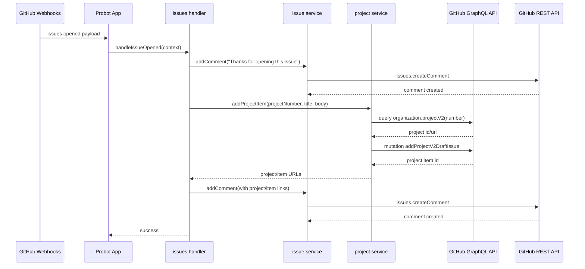
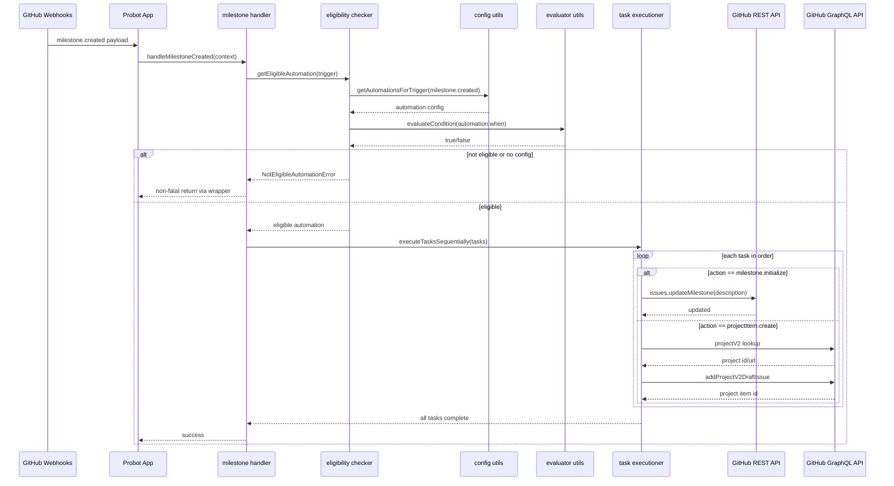

# Webhook Sequence Diagrams

## issues.opened Flow

## milestone.created Flow

## Error Behavior

- NotEligibleAutomationError is handled as expected and non-fatal.
- Other errors are logged and rethrown by wrapper for visibility.

Relevant implementation:

- src/index.ts
- src/handlers/eligible.ts
- src/handlers/milestones.ts
